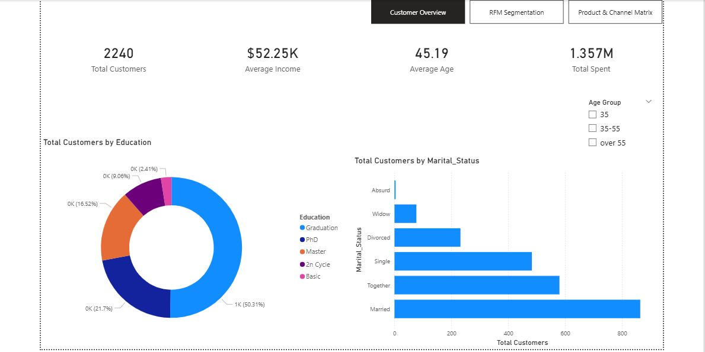

# Customer Segmentation & Marketing Analytics Dashboard (Power BI)

## 📌 Executive Summary
An end-to-end Power BI analytics project designed to segment retail customers using **RFM (Recency, Frequency, Monetary)** analysis on a marketing campaign dataset. The interactive 3-page report translates raw customer transactional data into actionable business strategies for targeted marketing, churn prevention, and product focus.

---

## 🛠️ Tech Stack & Methodology
* **Tool:** Power BI Desktop
* **Data Processing:** Power Query (Data cleaning, handling nulls, standardizing demographics)
* **Modeling:** DAX (Custom measures, calculated columns, statistical percentile scoring)
* **Framework:** RFM Segmentation (Recency, Frequency, Monetary analysis)

---

## 📊 Dashboard Architecture & Layout

### Page 1: Customer Overview

* **Key Metrics:** Total Customers, Average Income, Average Age, Total Spent.
* **Demographics:** Customer distribution broken down by Education and Marital Status.

### Page 2: RFM Segmentation & Behavioral Analysis

* **Segment Breakdown:** Distribution of customer segments (*Champions*, *At-Risk*, *Lost*, *New*, *Mid-Tier*).
* **Revenue Mapping:** Total spend comparison across each behavioral segment.
* **Interactive Controls:** Dynamic `Age Group` filtering across all visual panels.

### Page 3: Product & Channel Preference Matrix

* **Product Performance:** Revenue distribution across categories (Wines, Meats, Gold, Fish, Fruits, Sweets).
* **Channel Heatmap:** Purchase preference breakdown (*In-Store*, *Web*, *Catalog*).
* **Promotion Sensitivity:** Analysis of deal and discount adoption across segments.

---

## 💡 Key Business Insights
1. **Core Revenue Drivers:** Wines and Meat products generate the vast majority of total sales across all customer groups.
2. **High-Value Customers:** *Champions* display high frequency and spend, purchasing heavily via store and catalog channels without relying on promotional deals.
3. **Churn Risks:** High historical spenders in the *At-Risk* segment show dropping recency, signaling an immediate need for high-value re-engagement campaigns.
4. **Discount Targeting:** Mid-tier and lower-income segments demonstrate the highest response rates to deal-based promotions (`NumDealsPurchases`).

---

## ⚙️ Project Setup & Installation

Follow these steps to explore or modify the project locally:

1. *Clone the Repository:*
   ```bash
   git clone [https://github.com/Mubarak-lab-droid/Customer_Segmentation_RFM.git](https://github.com/Mubarak-lab-droid/Customer_Segmentation_RFM.git)
